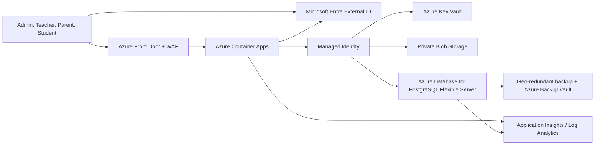

# Azure Enterprise Architecture

## Decision Record

School Hub contains personally identifiable information and payment-related records. The MVP must not be promoted by simply placing `data/db.json` on a cloud host. The production target is a managed Azure workload with identity-based access, private data services, recoverable backups, and audit monitoring.

## Target Architecture

## Azure Services

| Concern | Azure Service | Required Configuration |
| --- | --- | --- |
| User identity | Microsoft Entra External ID | Hosted sign-in, MFA/conditional access policy, application roles |
| API hosting | Azure Container Apps | Managed identity, minimum replicas for availability, no embedded secrets |
| Edge security | Azure Front Door Premium + WAF | TLS, managed WAF rule set, rate limiting, private origin |
| Relational data | Azure Database for PostgreSQL Flexible Server | Private networking, zone-redundant HA, Microsoft Entra auth, encryption, geo-redundant backup |
| Documents | Azure Blob Storage | No public access, private endpoints, versioning, soft delete |
| Keys/secrets | Azure Key Vault Premium when compliance requires HSM backing | RBAC, purge protection, private endpoint, customer-managed-key decision before database creation |
| Observability | Application Insights + Log Analytics + Azure Monitor alerts | Authentication anomalies, failures, latency, backup failure alerts |
| Long retention | Azure Backup for PostgreSQL | Policy-driven protected backups and restore drills |

Azure Database for PostgreSQL Flexible Server encrypts managed data, logs, WAL segments, and backups at rest by default. Customer-managed keys provide additional key control but must be chosen when the server is created, so this decision must be signed off before provisioning production. Microsoft documents that long-term Azure Backup retention can extend to ten years and isolates protected backup data from the source subscription for stronger ransomware resilience.

## Identity Model

- Human users authenticate through Microsoft Entra External ID; do not maintain school-user passwords in this application.
- Roles should be `PlatformAdmin`, `SchoolAdmin`, `Teacher`, `Accountant`, `Parent`, and `Student`.
- The app uses a managed identity to connect to PostgreSQL and Blob Storage; it does not store database passwords.
- Production administrators use privileged access procedures and MFA; no shared administrator login is allowed.

## Data Protection Model

- Use PostgreSQL relational identifiers and tenant/school ownership columns on every business table.
- Encrypt traffic with TLS; database and storage services remain inaccessible from the public internet.
- Store admission documents and receipts in Blob Storage, not database rows or local disk.
- Maintain immutable audit records for logins, exports, fee edits, attendance edits, and role changes.
- Define retention/deletion policies for student and guardian personal information.
- Test point-in-time recovery and disaster recovery before onboarding a live school.

## Migration Phases

### Phase 1: Foundation Included Here

- Security headers, expiring local sessions, sign-in throttling, and fail-closed production startup checks.
- Azure data-foundation Bicep template for secure managed services.
- Documented safety boundary: do not load real records into the MVP data store.

### Phase 2: Application Refactor Required

- Replace `lib/store.js` with a PostgreSQL repository and schema migrations.
- Implement Entra token verification and role authorization middleware.
- Add audit tables/events, record-level authorization, file upload scanning, and export controls.

### Phase 3: Azure Deployment

- Deploy data foundation into a non-production subscription first.
- Deploy the containerized API/UI behind Front Door WAF.
- Configure monitoring and backup alerts; complete restore, penetration, and privacy tests.
- Migrate data only after sign-off.

## Deployment Inputs

The template in `infra/azure/data-foundation.bicep` deliberately provisions the protected data foundation before deploying application containers. It enables PostgreSQL geo-redundant operational backup, private connectivity, and diagnostic streaming. Before real data is accepted, add an Azure Backup vault and retention policy for isolated long-term backups, then complete a documented restore drill.

The template requires an Azure tenant ID and a secure PostgreSQL bootstrap password at deployment time. That password should be rotated or disabled once Microsoft Entra database administrators and application managed-identity access are configured.

## Official Azure References

- Azure Well-Architected Framework: `https://learn.microsoft.com/azure/well-architected/what-is-well-architected-framework`
- PostgreSQL security overview: `https://learn.microsoft.com/azure/postgresql/flexible-server/security-overview`
- PostgreSQL data encryption: `https://learn.microsoft.com/azure/postgresql/flexible-server/security-data-encryption`
- PostgreSQL Microsoft Entra authentication: `https://learn.microsoft.com/azure/postgresql/flexible-server/security-entra-concepts`
- PostgreSQL Azure Backup: `https://learn.microsoft.com/azure/backup/backup-azure-database-postgresql-flex-overview`
- Microsoft Entra External ID: `https://learn.microsoft.com/entra/external-id/external-identities-overview`
